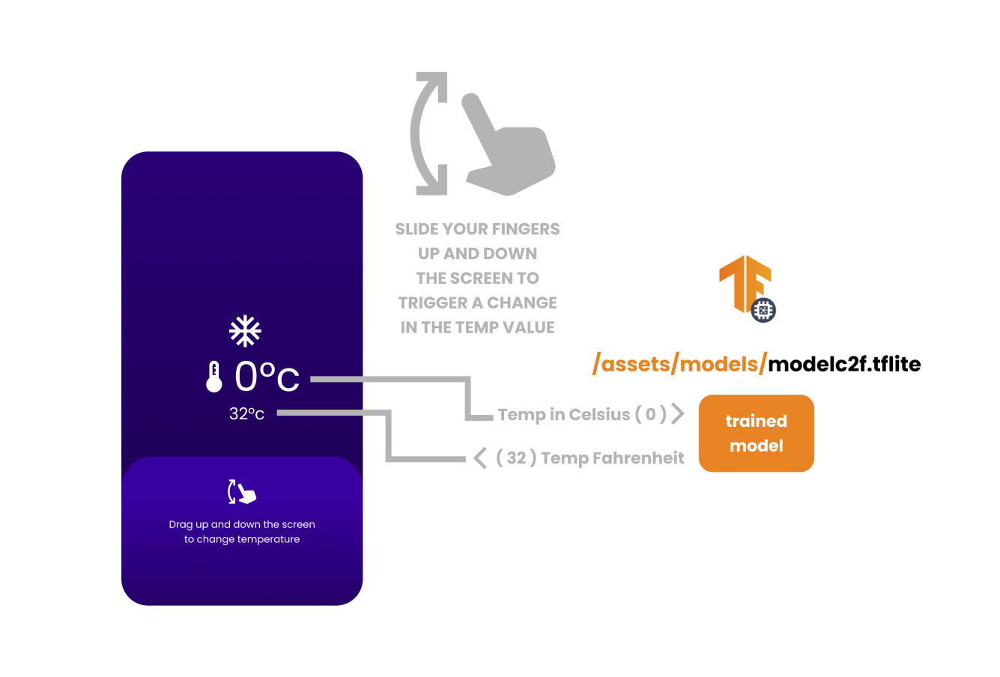
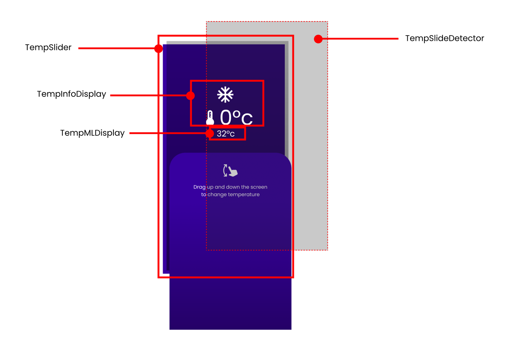
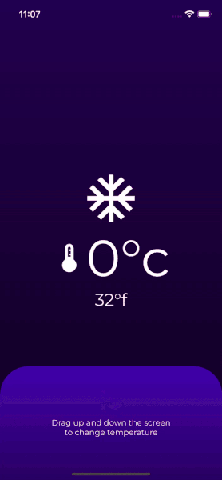

# On-Device ML using Flutter and TensorFlow Lite

This is a companion repo for the Medium tutorial on On-Device ML in Flutter with Tensorflow Lite, where we build a Flutter app that consumes a pre-trained model trained in Google Colab, and loaded onto a Flutter app for an on-device ML experience. The trained model converts a supplied Celsius degree into Fahrenheit.

###Medium Article Links:###
* [Part 1 of the Tutorial](https://medium.com/@romanejaquez/on-device-ml-using-flutter-and-tensorflow-lite-pt-1-model-training-2a84a685f2de)
* [Part 2 of the Tutorial](https://medium.com/@romanejaquez/on-device-ml-using-flutter-and-tensorflow-lite-pt-2-consume-your-trained-model-in-flutter-470bf314cd2d)

This is the schematics of what we accomplished in this Flutter app:

This is what you should expect at the end of the project:

* Provided Google Colab Notebook [here](c2f_tflite_model.ipynb)

* Already trained Tensorflow Lite ML model available in the **assets/models/** folder; filename **modelc2f.tflite**.

### Please don't forget to follow me on social media:

- On Twitter ([@drcoderz](https://www.twitter.com/drcoderz))
- On YouTube ([Roman Just Codes](https://www.youtube.com/channel/UCKsp3r1ERjCpKJtD2n5WtPg))
- On my [Personal Portfolio](https://romanjustcodes.web.app/)
- On [Medium](https://medium.com/@romanejaquez)
- On [LinkedIn](https://www.linkedin.com/in/roman-jaquez-8941a424/)